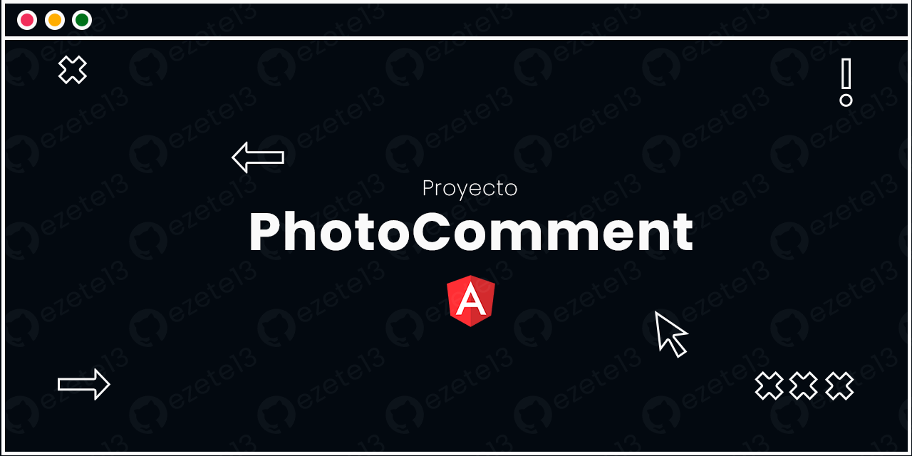
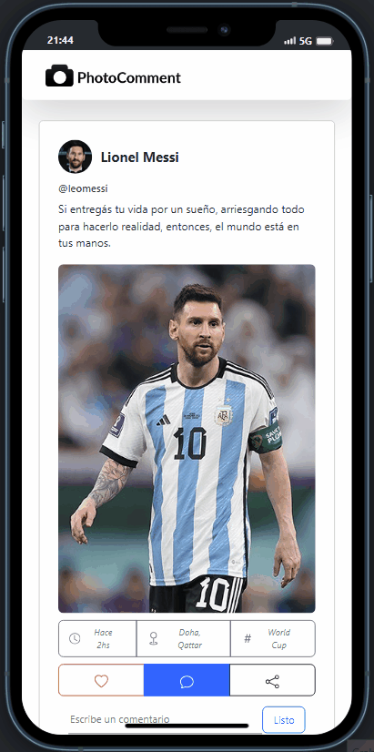

# PhotoComment

Este proyecto es una aplicación web desarrollada en Angular para una entrega universitaria, y que simula un sencillo posteo de una fotografia de una red social básica, inspirada en el estilo de Instagram y Facebook. 

# Funcionalidades

- Visualizar una figura estática (por ejemplo, en este caso Lionel Messi 🇦🇷).
- Agregar comentarios.
- Editar comentarios existentes.
- Borrar comentarios.
- Interfaz inspirda en Instagram y Facebook.

# DEMO

# ¿Cómo funciona?

- Es una aplicación con estado no persistente (No utiliza Base de Datos).
- Al recargar la página, los comentarios se reinician.
- Puedes agregar un comentario nuevo usando el formulario de comentarios.
- También puedes editar o eliminar comentarios existentes haciendo clic en los botones correspondientes.

# Tecnologías Utilizadas

-Angular
-HTML
-CSS
-TypeScript

# Instalación y Ejecución

1. Clona este repositorio (git clone https://github.com/ezete13/PhotoComment.git)
2. Instalar dependencias (npm install)
3. Ejecutar Servidor (ng serve)

# Contribuir
¡Siéntete libre de contribuir a este proyecto! Puedes enviar pull requests con nuevas características, mejoras o correcciones de errores.

# Créditos
Este proyecto fue desarrollado como parte de un proyecto universitario por Ezequiel Tello.

# Licencia
Este proyecto está bajo la licencia [Licencia](LICENSE.md) - consulta el archivo [LICENSE.md] para más detalles.

